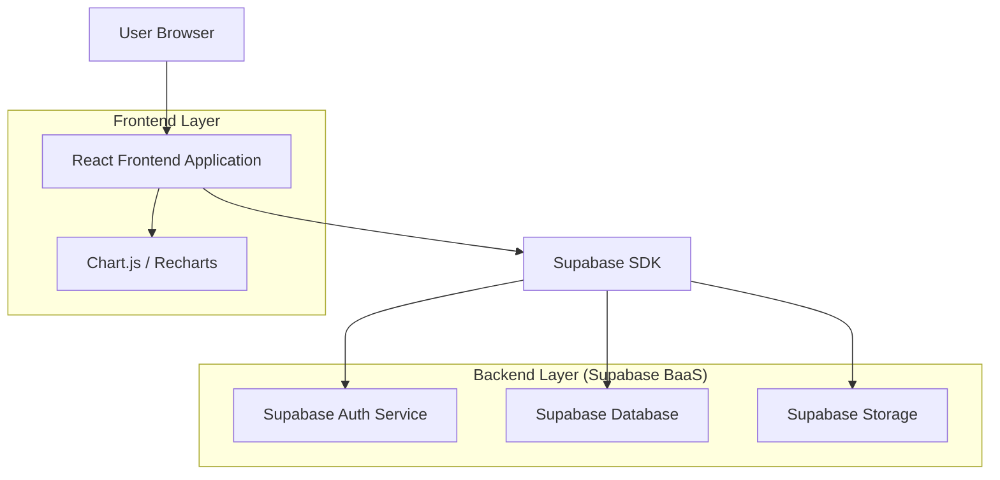
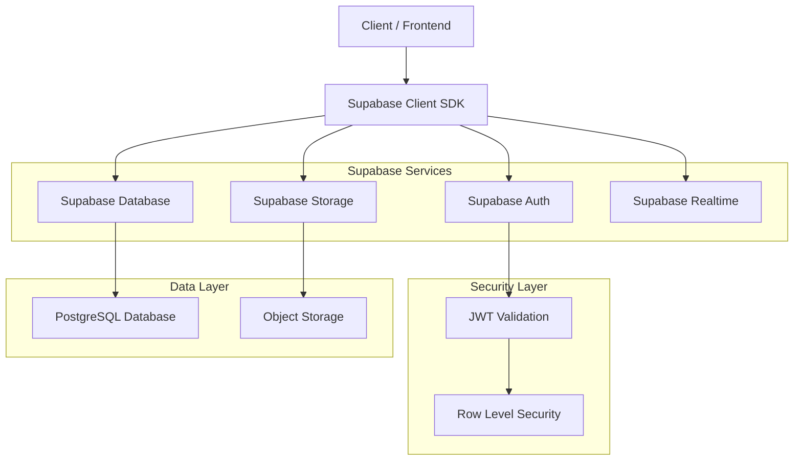
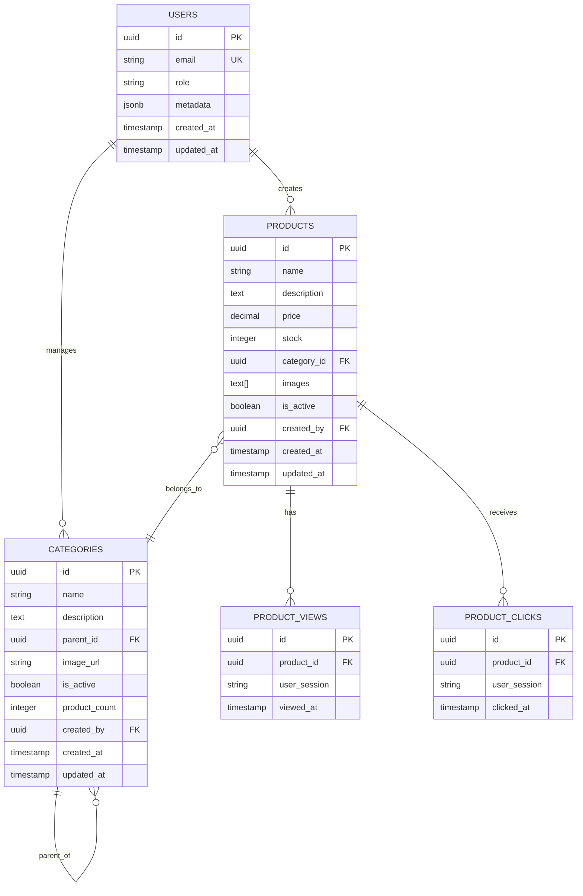

## 1. Architecture design



## 2. Technology Description
- **Frontend**: React@18 + TypeScript + TailwindCSS@3 + Vite
- **Initialization Tool**: vite-init
- **Backend**: Supabase (Backend-as-a-Service)
- **Authentication**: Supabase Auth con JWT
- **Database**: Supabase PostgreSQL
- **Storage**: Supabase Storage para imágenes
- **Charts**: Chart.js o Recharts para visualización de métricas
- **UI Components**: HeadlessUI + Heroicons

## 3. Route definitions
| Route | Purpose |
|-------|---------|
| /login | Página de autenticación para administradores |
| /dashboard | Vista principal con métricas generales |
| /products | Listado y gestión de productos |
| /products/new | Formulario de creación de producto |
| /products/:id/edit | Formulario de edición de producto |
| /categories | Gestión de categorías |
| /categories/new | Crear nueva categoría |
| /categories/:id/edit | Editar categoría existente |
| /metrics | Dashboard de métricas y análisis |
| /settings | Configuración de usuario y sistema |

## 4. API definitions

### 4.1 Authentication APIs (Supabase)
```
POST /auth/v1/token
```
Request:
```json
{
  "email": "admin@example.com",
  "password": "securepassword"
}
```

### 4.2 Product APIs (Supabase)
```
GET /rest/v1/products?select=*
POST /rest/v1/products
PUT /rest/v1/products?id=eq.{id}
DELETE /rest/v1/products?id=eq.{id}
```

Product Type Definition:
```typescript
interface Product {
  id: string
  name: string
  description: string
  price: number
  stock: number
  category_id: string
  images: string[] // URLs de Supabase Storage
  is_active: boolean
  created_at: string
  updated_at: string
}
```

### 4.3 Category APIs (Supabase)
```
GET /rest/v1/categories?select=*
POST /rest/v1/categories
PUT /rest/v1/categories?id=eq.{id}
DELETE /rest/v1/categories?id=eq.{id}
```

Category Type Definition:
```typescript
interface Category {
  id: string
  name: string
  description: string
  parent_id?: string
  image_url?: string
  is_active: boolean
  product_count: number
  created_at: string
  updated_at: string
}
```

### 4.4 Metrics APIs (Supabase)
```
GET /rest/v1/product_views?select=*&product_id=eq.{id}
GET /rest/v1/product_clicks?select=*&product_id=eq.{id}
```

Metrics Type Definition:
```typescript
interface ProductView {
  id: string
  product_id: string
  viewed_at: string
  user_session?: string
}

interface ProductClick {
  id: string
  product_id: string
  clicked_at: string
  user_session?: string
}
```

## 5. Server architecture diagram



## 6. Data model

### 6.1 Data model definition


### 6.2 Data Definition Language

Users Table (usuarios administradores)
```sql
-- create table
CREATE TABLE users (
    id UUID PRIMARY KEY DEFAULT gen_random_uuid(),
    email VARCHAR(255) UNIQUE NOT NULL,
    role VARCHAR(20) DEFAULT 'admin' CHECK (role IN ('admin', 'super_admin')),
    metadata JSONB DEFAULT '{}',
    created_at TIMESTAMP WITH TIME ZONE DEFAULT NOW(),
    updated_at TIMESTAMP WITH TIME ZONE DEFAULT NOW()
);

-- enable RLS
ALTER TABLE users ENABLE ROW LEVEL SECURITY;

-- create policies
CREATE POLICY "Users can view their own profile" ON users
    FOR SELECT USING (auth.uid() = id);

CREATE POLICY "Super admins can manage all users" ON users
    FOR ALL USING (auth.jwt() ->> 'role' = 'super_admin');
```

Products Table
```sql
-- create table
CREATE TABLE products (
    id UUID PRIMARY KEY DEFAULT gen_random_uuid(),
    name VARCHAR(255) NOT NULL,
    description TEXT,
    price DECIMAL(10,2) NOT NULL CHECK (price >= 0),
    stock INTEGER NOT NULL DEFAULT 0 CHECK (stock >= 0),
    category_id UUID REFERENCES categories(id),
    images TEXT[] DEFAULT '{}',
    is_active BOOLEAN DEFAULT true,
    created_by UUID REFERENCES users(id),
    created_at TIMESTAMP WITH TIME ZONE DEFAULT NOW(),
    updated_at TIMESTAMP WITH TIME ZONE DEFAULT NOW()
);

-- create indexes
CREATE INDEX idx_products_category ON products(category_id);
CREATE INDEX idx_products_active ON products(is_active);
CREATE INDEX idx_products_created_by ON products(created_by);

-- enable RLS
ALTER TABLE products ENABLE ROW LEVEL SECURITY;

-- create policies
CREATE POLICY "Authenticated users can view active products" ON products
    FOR SELECT USING (is_active = true OR auth.role() = 'authenticated');

CREATE POLICY "Admins can manage all products" ON products
    FOR ALL USING (auth.jwt() ->> 'role' IN ('admin', 'super_admin'));
```

Categories Table
```sql
-- create table
CREATE TABLE categories (
    id UUID PRIMARY KEY DEFAULT gen_random_uuid(),
    name VARCHAR(255) NOT NULL,
    description TEXT,
    parent_id UUID REFERENCES categories(id),
    image_url TEXT,
    is_active BOOLEAN DEFAULT true,
    product_count INTEGER DEFAULT 0,
    created_by UUID REFERENCES users(id),
    created_at TIMESTAMP WITH TIME ZONE DEFAULT NOW(),
    updated_at TIMESTAMP WITH TIME ZONE DEFAULT NOW()
);

-- create indexes
CREATE INDEX idx_categories_parent ON categories(parent_id);
CREATE INDEX idx_categories_active ON categories(is_active);

-- enable RLS
ALTER TABLE categories ENABLE ROW LEVEL SECURITY;

-- create policies
CREATE POLICY "Authenticated users can view categories" ON categories
    FOR SELECT USING (true);

CREATE POLICY "Admins can manage categories" ON categories
    FOR ALL USING (auth.jwt() ->> 'role' IN ('admin', 'super_admin'));
```

Product Views Table
```sql
-- create table
CREATE TABLE product_views (
    id UUID PRIMARY KEY DEFAULT gen_random_uuid(),
    product_id UUID REFERENCES products(id) NOT NULL,
    user_session TEXT,
    viewed_at TIMESTAMP WITH TIME ZONE DEFAULT NOW()
);

-- create indexes
CREATE INDEX idx_product_views_product ON product_views(product_id);
CREATE INDEX idx_product_views_session ON product_views(user_session);
CREATE INDEX idx_product_views_date ON product_views(viewed_at);

-- enable RLS
ALTER TABLE product_views ENABLE ROW LEVEL SECURITY;

-- create policies
CREATE POLICY "Anyone can create product views" ON product_views
    FOR INSERT WITH CHECK (true);

CREATE POLICY "Admins can view product views" ON product_views
    FOR SELECT USING (auth.jwt() ->> 'role' IN ('admin', 'super_admin'));
```

Product Clicks Table
```sql
-- create table
CREATE TABLE product_clicks (
    id UUID PRIMARY KEY DEFAULT gen_random_uuid(),
    product_id UUID REFERENCES products(id) NOT NULL,
    user_session TEXT,
    clicked_at TIMESTAMP WITH TIME ZONE DEFAULT NOW()
);

-- create indexes
CREATE INDEX idx_product_clicks_product ON product_clicks(product_id);
CREATE INDEX idx_product_clicks_session ON product_clicks(user_session);
CREATE INDEX idx_product_clicks_date ON product_clicks(clicked_at);

-- enable RLS
ALTER TABLE product_clicks ENABLE ROW LEVEL SECURITY;

-- create policies
CREATE POLICY "Anyone can create product clicks" ON product_clicks
    FOR INSERT WITH CHECK (true);

CREATE POLICY "Admins can view product clicks" ON product_clicks
    FOR SELECT USING (auth.jwt() ->> 'role' IN ('admin', 'super_admin'));
```

### 6.3 Storage Configuration
```sql
-- Create storage bucket for product images
INSERT INTO storage.buckets (id, name, public, file_size_limit, allowed_mime_types)
VALUES ('product-images', 'product-images', true, 5242880, ARRAY['image/jpeg', 'image/png', 'image/webp']);

-- Create storage policies
CREATE POLICY "Admins can upload product images" ON storage.objects
    FOR INSERT WITH CHECK (
        bucket_id = 'product-images' AND
        auth.jwt() ->> 'role' IN ('admin', 'super_admin')
    );

CREATE POLICY "Public can view product images" ON storage.objects
    FOR SELECT USING (bucket_id = 'product-images');
```

### 6.4 Functions and Triggers
```sql
-- Function to update product count in categories
CREATE OR REPLACE FUNCTION update_category_product_count()
RETURNS TRIGGER AS $$
BEGIN
    IF TG_OP = 'INSERT' THEN
        UPDATE categories 
        SET product_count = product_count + 1 
        WHERE id = NEW.category_id;
        RETURN NEW;
    ELSIF TG_OP = 'DELETE' THEN
        UPDATE categories 
        SET product_count = product_count - 1 
        WHERE id = OLD.category_id;
        RETURN OLD;
    END IF;
END;
$$ LANGUAGE plpgsql;

-- Trigger for product count updates
CREATE TRIGGER trigger_update_product_count
    AFTER INSERT OR DELETE ON products
    FOR EACH ROW
    EXECUTE FUNCTION update_category_product_count();
```