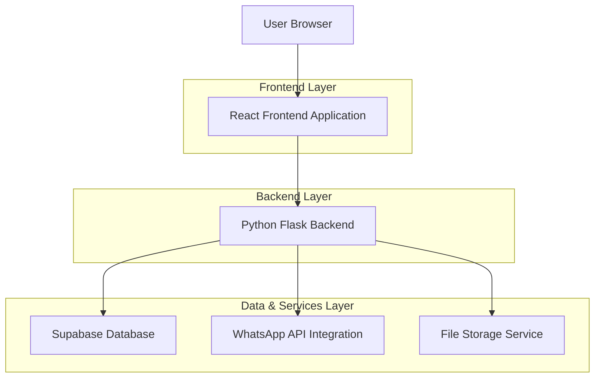
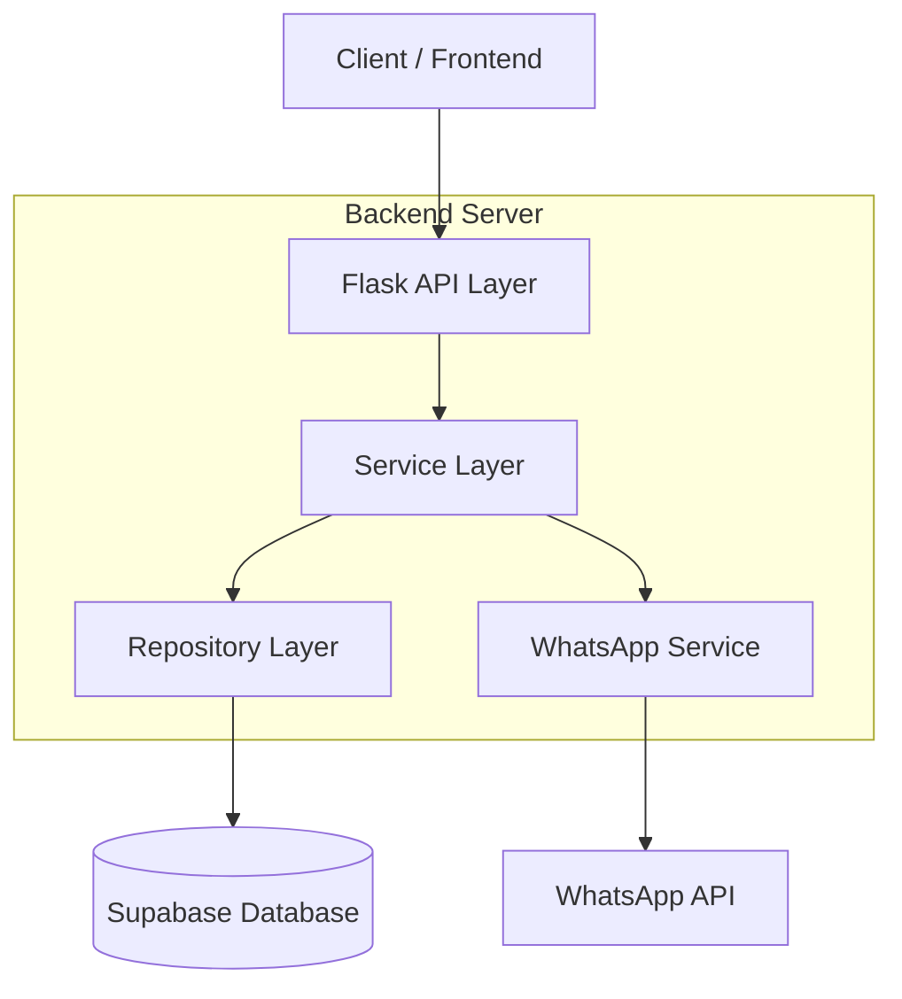
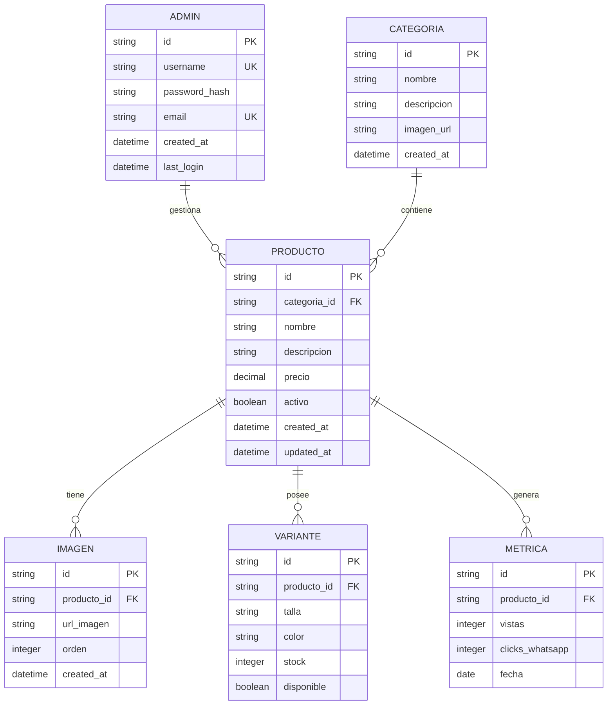

## 1. Architecture design



## 2. Technology Description

- **Frontend**: React@18 + tailwindcss@3 + vite
- **Initialization Tool**: vite-init
- **Backend**: Python Flask
- **Database**: Supabase (PostgreSQL)
- **Autenticación**: Flask-JWT-Extended
- **Almacenamiento de Imágenes**: Supabase Storage

## 3. Route definitions

| Route | Purpose |
|-------|---------|
| / | Página principal con catálogo de productos |
| /producto/:id | Vista detallada de producto individual |
| /admin/login | Página de login para administradores |
| /admin/dashboard | Dashboard principal del administrador |
| /admin/productos | Lista y gestión de productos |
| /admin/productos/nuevo | Formulario para crear nuevo producto |
| /admin/productos/:id/editar | Formulario para editar producto existente |
| /admin/categorias | Gestión de categorías |
| /admin/metricas | Dashboard de análisis y métricas |

## 4. API definitions

### 4.1 Core API

#### Autenticación de Admin
```
POST /api/auth/login
```

Request:
| Param Name | Param Type | isRequired | Description |
|------------|------------|------------|-------------|
| username | string | true | Nombre de usuario del admin |
| password | string | true | Contraseña del admin |

Response:
| Param Name | Param Type | Description |
|------------|------------|-------------|
| access_token | string | JWT token para autenticación |
| user | object | Datos del usuario autenticado |

Example:
```json
{
  "username": "admin",
  "password": "securepassword123"
}
```

#### Gestión de Productos
```
GET /api/productos
```

Response:
| Param Name | Param Type | Description |
|------------|------------|-------------|
| products | array | Lista de productos con imágenes y variantes |
| total | number | Total de productos |

```
POST /api/productos
```

Request:
| Param Name | Param Type | isRequired | Description |
|------------|------------|------------|-------------|
| nombre | string | true | Nombre del producto |
| descripcion | string | true | Descripción del producto |
| precio | number | true | Precio del producto |
| categoria_id | string | true | ID de la categoría |
| imagenes | array | true | URLs de las imágenes del producto |
| variantes | array | true | Variantes de talla/color con stock |

#### Métricas y Analytics
```
GET /api/metricas/resumen
```

Response:
| Param Name | Param Type | Description |
|------------|------------|-------------|
| total_productos | number | Total de productos en tienda |
| visitas_hoy | number | Visitas del día actual |
| productos_mas_vistos | array | Top 5 productos más vistos |
| conversion_whatsapp | number | Tasa de conversión a WhatsApp |

## 5. Server architecture diagram



## 6. Data model

### 6.1 Data model definition



### 6.2 Data Definition Language

#### Tabla de Administradores
```sql
-- create table
CREATE TABLE admins (
    id UUID PRIMARY KEY DEFAULT gen_random_uuid(),
    username VARCHAR(50) UNIQUE NOT NULL,
    password_hash VARCHAR(255) NOT NULL,
    email VARCHAR(255) UNIQUE NOT NULL,
    created_at TIMESTAMP WITH TIME ZONE DEFAULT NOW(),
    last_login TIMESTAMP WITH TIME ZONE
);

-- create index
CREATE INDEX idx_admins_username ON admins(username);
CREATE INDEX idx_admins_email ON admins(email);
```

#### Tabla de Categorías
```sql
-- create table
CREATE TABLE categorias (
    id UUID PRIMARY KEY DEFAULT gen_random_uuid(),
    nombre VARCHAR(100) NOT NULL,
    descripcion TEXT,
    imagen_url VARCHAR(500),
    created_at TIMESTAMP WITH TIME ZONE DEFAULT NOW()
);

-- create index
CREATE INDEX idx_categorias_nombre ON categorias(nombre);
```

#### Tabla de Productos
```sql
-- create table
CREATE TABLE productos (
    id UUID PRIMARY KEY DEFAULT gen_random_uuid(),
    categoria_id UUID REFERENCES categorias(id) ON DELETE CASCADE,
    nombre VARCHAR(200) NOT NULL,
    descripcion TEXT,
    precio DECIMAL(10,2) NOT NULL CHECK (precio >= 0),
    activo BOOLEAN DEFAULT true,
    created_at TIMESTAMP WITH TIME ZONE DEFAULT NOW(),
    updated_at TIMESTAMP WITH TIME ZONE DEFAULT NOW()
);

-- create index
CREATE INDEX idx_productos_categoria ON productos(categoria_id);
CREATE INDEX idx_productos_activo ON productos(activo);
CREATE INDEX idx_productos_precio ON productos(precio);
```

#### Tabla de Imágenes
```sql
-- create table
CREATE TABLE imagenes (
    id UUID PRIMARY KEY DEFAULT gen_random_uuid(),
    producto_id UUID REFERENCES productos(id) ON DELETE CASCADE,
    url_imagen VARCHAR(500) NOT NULL,
    orden INTEGER DEFAULT 0,
    created_at TIMESTAMP WITH TIME ZONE DEFAULT NOW()
);

-- create index
CREATE INDEX idx_imagenes_producto ON imagenes(producto_id);
CREATE INDEX idx_imagenes_orden ON imagenes(orden);
```

#### Tabla de Variantes
```sql
-- create table
CREATE TABLE variantes (
    id UUID PRIMARY KEY DEFAULT gen_random_uuid(),
    producto_id UUID REFERENCES productos(id) ON DELETE CASCADE,
    talla VARCHAR(10) NOT NULL,
    color VARCHAR(50) NOT NULL,
    stock INTEGER NOT NULL DEFAULT 0 CHECK (stock >= 0),
    disponible BOOLEAN DEFAULT true,
    UNIQUE(producto_id, talla, color)
);

-- create index
CREATE INDEX idx_variantes_producto ON variantes(producto_id);
CREATE INDEX idx_variantes_disponible ON variantes(disponible);
```

#### Tabla de Métricas
```sql
-- create table
CREATE TABLE metricas (
    id UUID PRIMARY KEY DEFAULT gen_random_uuid(),
    producto_id UUID REFERENCES productos(id) ON DELETE CASCADE,
    vistas INTEGER DEFAULT 0,
    clicks_whatsapp INTEGER DEFAULT 0,
    fecha DATE DEFAULT CURRENT_DATE,
    UNIQUE(producto_id, fecha)
);

-- create index
CREATE INDEX idx_metricas_producto ON metricas(producto_id);
CREATE INDEX idx_metricas_fecha ON metricas(fecha);

-- Políticas de acceso básicas
GRANT SELECT ON ALL TABLES TO anon;
GRANT ALL PRIVILEGES ON ALL TABLES TO authenticated;
```