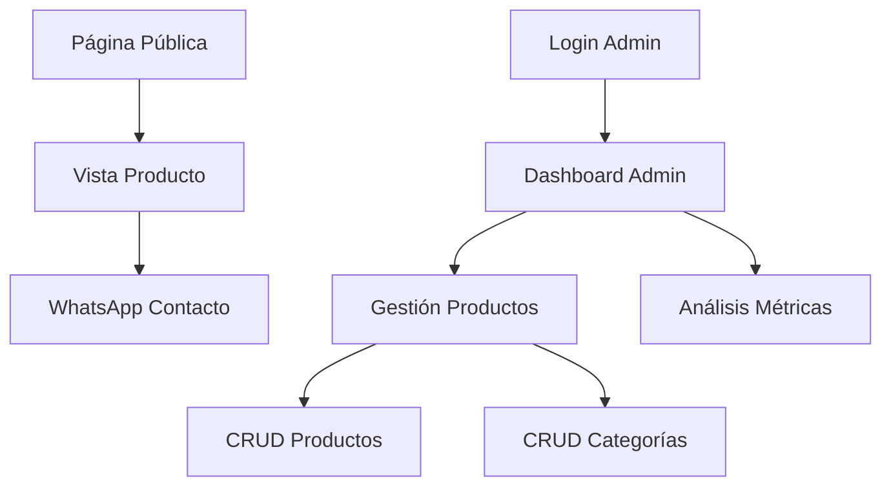

## 1. Product Overview
Tienda de ropa online con panel administrativo para gestión de productos y contacto vía WhatsApp. Los clientes pueden navegar productos y contactar directamente por WhatsApp para realizar compras.

El sistema permite al administrador controlar stock, precios, imágenes y variantes de productos, además de analizar métricas de ventas y comportamiento de usuarios.

## 2. Core Features

### 2.1 User Roles
| Role | Registration Method | Core Permissions |
|------|---------------------|------------------|
| Cliente | Navegación anónima | Ver productos, contactar vía WhatsApp |
| Administrador | Login con credenciales | Gestionar productos, ver métricas, controlar stock |

### 2.2 Feature Module
Nuestra tienda de ropa consiste en las siguientes páginas principales:
1. **Página Pública**: catálogo de productos, filtros por categoría, vista detallada con botón de WhatsApp.
2. **Login Admin**: acceso seguro al panel administrativo.
3. **Dashboard Admin**: métricas generales, productos más vendidos, visitas.
4. **Gestión de Productos**: CRUD completo de productos con imágenes, variantes (talla/color), stock y precios.
5. **Gestión de Categorías**: organizar productos por categorías.
6. **Análisis de Métricas**: visualizar estadísticas de ventas, productos populares, conversiones.

### 2.3 Page Details
| Page Name | Module Name | Feature description |
|-----------|-------------|---------------------|
| Página Pública | Catálogo de Productos | Mostrar grid de productos con imagen, nombre, precio y botón WhatsApp. Filtrar por categoría, talla, color. |
| Página Pública | Vista Detalle Producto | Mostrar galería de imágenes, descripción, variantes disponibles, precio y botón WhatsApp pre-cargado con información del producto. |
| Login Admin | Formulario de Acceso | Campos para usuario y contraseña, validación básica, redirección al dashboard. |
| Dashboard Admin | Métricas Generales | Mostrar total de productos, visitas del día, productos más vistos, gráficos de tendencias. |
| Gestión de Productos | Lista de Productos | Tabla con productos, búsqueda, filtros, acciones de editar/eliminar, indicador de stock bajo. |
| Gestión de Productos | Formulario Producto | Campos para nombre, descripción, precio, categoría, múltiples imágenes, variantes (talla/color/stock). |
| Gestión de Categorías | CRUD Categorías | Crear, editar, eliminar categorías, asignar productos. |
| Análisis de Métricas | Dashboard de Métricas | Gráficos de productos más vistos, tasa de conversión WhatsApp, evolución temporal de visitas. |

## 3. Core Process

### Flujo del Cliente
1. Usuario ingresa a la página principal
2. Navega por el catálogo usando filtros de categoría/talla/color
3. Selecciona un producto para ver detalles
4. Presiona botón de WhatsApp que carga mensaje predefinido con información del producto
5. Se abre WhatsApp web/móvil para completar la compra

### Flujo del Administrador
1. Admin accede al login con credenciales
2. Visualiza dashboard con métricas generales
3. Gestiona productos: crea nuevos, edita existentes, actualiza stock/precios
4. Sube múltiples imágenes por producto
5. Define variantes (talla/color) con stock individual
6. Analiza métricas para tomar decisiones de negocio

## 4. User Interface Design

### 4.1 Design Style
- **Colores primarios**: Blanco (#FFFFFF), Negro (#000000) para texto principal
- **Colores secundarios**: Gris claro (#F5F5F5) para fondos, Verde WhatsApp (#25D366) para botones de contacto
- **Estilo de botones**: Bordes redondeados, sombra sutil, efecto hover
- **Tipografía**: Fuente sans-serif moderna (Inter/Roboto), tamaños: 16px cuerpo, 24px títulos, 14px textos pequeños
- **Layout**: Grid responsivo de productos, cards con imagen prominente, navegación superior sticky
- **Iconos**: Estilo outline minimalista, uso de emojis para categorías cuando sea apropiado

### 4.2 Page Design Overview
| Page Name | Module Name | UI Elements |
|-----------|-------------|-------------|
| Página Pública | Catálogo de Productos | Grid 4 columnas desktop/2 tablet/1 móvil, cards con imagen 4:3, nombre en negrita, precio destacado, botón WhatsApp flotante verde con icono. |
| Página Pública | Vista Detalle Producto | Galería de imágenes con carousel, información en dos columnas, selector de variantes con botones, botón WhatsApp grande prominente. |
| Login Admin | Formulario de Acceso | Formulario centrado, campos con bordes suaves, botón principal ancho, fondo degradado sutil. |
| Dashboard Admin | Métricas Generales | Cards de estadísticas con iconos, gráficos de líneas/barras, tabla de productos top, colores corporativos sobrios. |
| Gestión de Productos | Lista de Productos | Tabla con imágenes miniatura, badges de stock, acciones con iconos, barra de búsqueda sticky. |
| Gestión de Productos | Formulario Producto | Layout en secciones (información básica, imágenes, variantes), drag & drop para imágenes, validación visual de campos. |

### 4.3 Responsiveness
- **Diseño**: Desktop-first con adaptación progresiva a tablet y móvil
- **Breakpoints**: 1200px (desktop), 768px (tablet), 320px (móvil)
- **Optimización táctil**: Botones mínimo 44px, espaciado generoso en móvil, swipe en galerías de imágenes